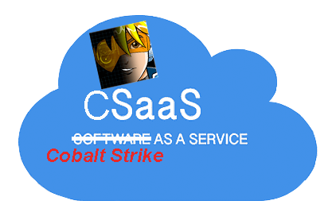

<p align="center">
  
</p>

# CSaaS?  Not quite...

No, this is not CSaaS.  This is a janky little script that literally sets Cobalt Strike's team server up as a Linux service.

Red teamers often run their team servers under screen sessions, which can be fraught with problems. Therefore, I figured out how to set up a team server to run as a service so screen sessions are a thing of the past.


### Usage

```
git clone https://github.com/0xBeacon/Cobalt-Strike-as-a-Service.git
cd Cobalt-Strike-as-a-Service
chmod +x ./setup.sh 
./setup.sh
```

Running setup.sh will ask the following questions: 

- The location of your cobalt strike directory
- The IP your team server is using
- The password for your team server
- The location of your malleable c2 profile

**Note:** _There is no vetting of information provided, so make sure it's correct._


